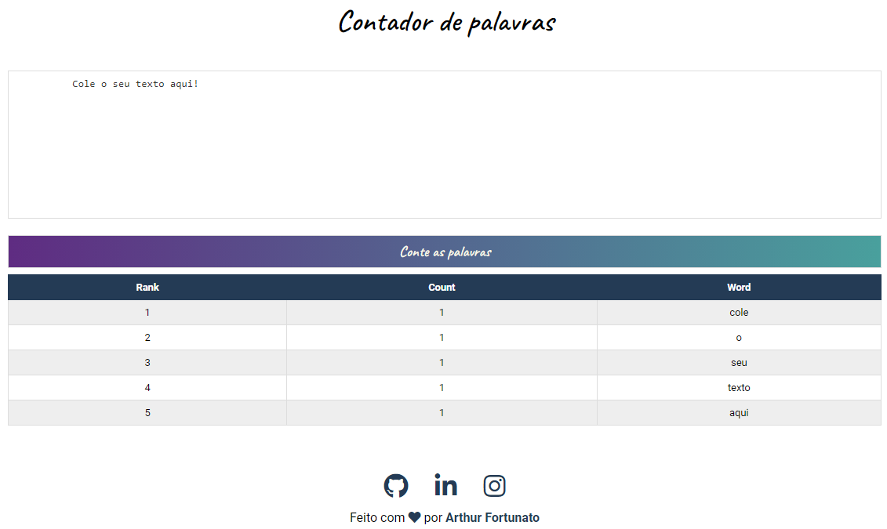

<h1 align="center">Word Frequency Counter</h1>
💻 Projeto

Word Frequency Counter é uma aplicação para realizar a contagem de palavras de um determinado texto de maneira simples e rápida. 

Link do deploy: https://contador-de-palavras.netlify.app/
<h1 align="center">
    
</h1>

 